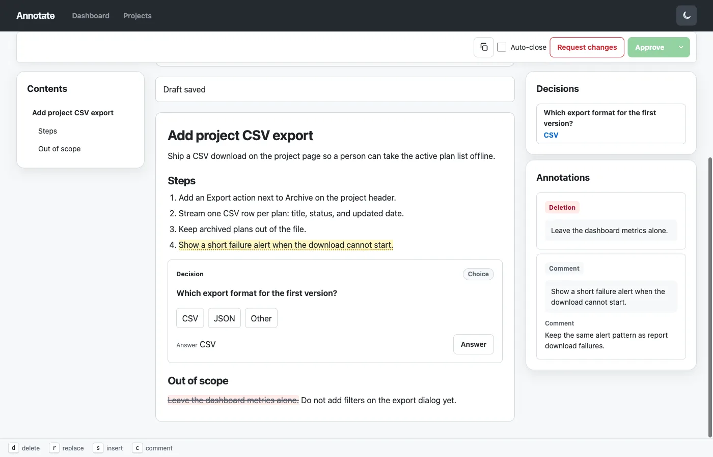

# Annotate

MCP server and GUI: immutable Markdown plan revisions, one review per revision, feedback back to the agent.

The agent submits a plan as Markdown. You open one revision, leave annotations where the text should change, and finish the review. When you request changes, feedback goes back to the agent; older revisions stay on the plan.

## Run it

There is no published image yet. [Manual deployment](docs/deployment/README.md) runs this checkout with Compose on http://127.0.0.1:24173.

How to use Annotate lives on the [wiki](https://github.com/YannikG/annotate-mcp/wiki).

[Agents start here](docs/installation/README.md#agents).
